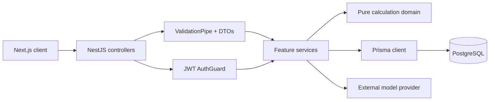

<div align="center">

# Sport Calorie API

**The calorie model, activity science, persistence, and authentication layer behind Sport Calorie.**

[](https://nestjs.com/)
[](https://www.typescriptlang.org/)
[](https://www.postgresql.org/)
[](https://www.prisma.io/)
[](https://swagger.io/)
[](https://jestjs.io/)

[Frontend repository](https://github.com/bohdanhora/sport-calorie)

</div>

## Overview

Sport Calorie API is a NestJS REST service for a personal health, fitness, and calorie tracker. It owns user identity, body profile, calorie and macro targets, the food catalog and diary, the activity catalog and log, weight history, and every daily aggregation the interface shows.

PostgreSQL provides persistence through Prisma with SQL migrations. Every formula lives in a framework-free domain layer that is unit tested in isolation, so a metric is defined once and never recomputed differently anywhere else.

## Core capabilities

- **Email and password authentication** - registration, login, rotating refresh tokens in an httpOnly cookie, logout, and per-endpoint rate limiting.
- **Sign in with Google** - a Google ID token is verified server side and exchanged for the same session, linked to an existing account when Google has verified the same address.
- **First-run onboarding** - one call stores body data, preferences and the starting weight, and records that the account has answered the wizard.
- **Body profile and preferences** - sex, birth date, height, target weight, activity level, goal, unit system, timezone, and interface language.
- **Calorie targets** - estimated BMR and TDEE, a recommended target derived from the goal, an explicit manual override that the system never changes, and per-day overrides.
- **Food catalog and diary** - reusable foods with any serving unit, a shared seeded catalog, per-user recently used foods, and diary entries that snapshot their nutrition on write.
- **Activity catalog and log** - ten seeded activity types with capability flags, walking and treadmill sessions with derived speed, and repetition-based workouts.
- **Exercise energy estimation** - MET-based calculation, the ACSM walking equation for speed and incline, intensity scaling, and a manual override that survives edits.
- **Weight history** - one measurement per local day, total change, and a least-squares weekly trend.
- **Server-side aggregation** - a full day, a compact day range, and a progress range with averages and an activity breakdown, each in a single request.
- **Automatic nutrition estimation** - an optional per-user provider that turns a described dish into a validated draft entry.
- **Timezone-correct days** - every record carries both the exact instant and the calendar day it belongs to in the user's timezone.

## Tech stack

| Area | Technology |
| --- | --- |
| Runtime framework | NestJS 11, Node.js 20+, TypeScript strict mode |
| Database | PostgreSQL 17, Prisma ORM, SQL migrations |
| API documentation | OpenAPI through `@nestjs/swagger` |
| Authentication | JWT access tokens, rotating refresh tokens, Passport, bcrypt |
| Validation | class-validator, class-transformer, global whitelisting |
| Security | helmet, CORS allowlist, throttling, AES-256-GCM secret storage |
| Logging | pino through nestjs-pino |
| Testing | Jest, ts-jest, supertest |
| Infrastructure | Docker, Docker Compose |

## Architecture



Three rules hold the design together:

1. **All calculation lives in `src/domain`.** Those modules are pure functions with no decorators and no database access, so every formula is unit tested in isolation. Services translate between the database and the domain, they never reimplement a formula.
2. **A metric is defined once.** Remaining calories, net calories, and the daily balance all come from `calculateCalorieBalance`. No controller or query recomputes them.
3. **The database is never exposed directly.** Every endpoint returns an explicit response DTO.

## The calorie model

Defined in `src/domain/energy/calorie-balance.ts` and used by every endpoint that reports calories.

```text
consumed   sum of the day's food entries
activity   sum of the day's logged activities
target     the day's resolved calorie target

net        = consumed - activity
remaining  = target + activity - consumed
balance    = net - target          positive is a surplus, negative is a deficit
```

Logged workouts are credited back to the day's allowance, which is what consumer trackers do and what users expect. The consequence is that the lifestyle activity level in the profile should describe habitual movement only, not workouts that get logged separately, otherwise the same effort is counted twice. The settings screen states this.

### Target resolution

A day's calorie target is resolved in this order:

1. an explicit override for that date, set through `PUT /api/targets/:date`;
2. the manual target on the profile, set through `PUT /api/profile/calorie-target`;
3. the recommended target derived from body data;
4. 2000 kcal, used only while the profile is too incomplete to compute anything.

A manual target is never recalculated or silently replaced. Sending `null` restores the recommended target.

### Recommended target

```text
BMR   Mifflin-St Jeor, floored at 800 kcal
TDEE  BMR x activity factor        1.2 sedentary to 1.9 very high
goal  TDEE x (1 + adjustment)      -15% lose, 0% maintain, +10% gain
```

The result is floored at BMR, so the service never recommends eating below resting expenditure. Protein is set at 1.8 g and fat at 0.8 g per kilogram of body weight, and carbohydrates take the remaining calories. Without a recorded weight a 30/40/30 split is used instead.

### Exercise energy

Every estimate comes from population averages and is never a measurement. The API marks it `ESTIMATED`, and a value the user types wins and stays `MANUAL` until it is cleared.

```text
kcal/min = MET x 3.5 x weightKg / 200
```

For walking and treadmill sessions the MET value comes from the ACSM walking equation rather than a lookup table, because a treadmill session is defined by its speed and incline:

```text
VO2 (ml/kg/min) = 0.1 x speed + 1.8 x speed x grade + 3.5     speed in m/min
MET             = VO2 / 3.5
```

Other activities use the catalog MET value scaled by intensity: 0.8 easy, 1.0 moderate, 1.3 hard. For repetition-based exercises logged without a duration, three seconds per repetition is assumed. If the user has no recorded weight, 70 kg is used and the response reports that through `usedFallbackWeight`.

Walking sessions accept any two of duration, distance, and average speed, and the third is derived. Measured duration and distance always win over a typed speed.

## Automatic nutrition estimation

A user can connect any OpenAI-compatible chat completions endpoint and describe a dish in words instead of typing every number. `POST /api/food-entries/parse` sends the description, receives structured JSON, validates it exactly like manual input, and returns a draft. Nothing reaches the diary until the user confirms the values in the form.

Three properties make this safe to ship:

- **The answer is data, never a command.** It is parsed and validated by `nutrition-payload.ts`, which rejects anything without a usable name, amount, and calorie value, discards macros outside a plausible range, and falls back to grams for an unknown unit. A malformed answer becomes a `502`, not a database row.
- **Every result is cached as a `Food`.** The parsed portion is stored with `source: EXTERNAL` and the normalized query as `externalId`, so repeating a dish costs nothing and keeps working without the provider.
- **The key never leaves the server.** It is encrypted with AES-256-GCM under `ENCRYPTION_KEY`, and the API only ever returns a mask such as `sk-...4f2a`.

Only dish descriptions the user submits are sent to the provider. No other diary content leaves the server.

## Data model

Eleven tables, all with UUID primary keys, `createdAt` and `updatedAt`, foreign keys, and indexes matching the query patterns.

| Table | Purpose |
| --- | --- |
| `users`, `refresh_tokens` | Identity and session rotation. A user has a password hash, a Google id, or both |
| `user_profiles` | Body data, preferences, timezone, language, manual targets, onboarding stamp |
| `daily_goals` | Per-day calorie and macro overrides |
| `foods`, `food_usages` | Reusable food definitions and per-user recency |
| `food_entries` | The diary, with nutrition snapshotted on write |
| `activity_types`, `activity_entries` | Activity catalog and the log |
| `weight_entries` | One measurement per local day |
| `nutrition_providers` | Encrypted external provider configuration |

Two decisions are worth calling out:

- **Walking is not a separate table.** A treadmill session is an `ActivityEntry` with a distance. One write path, one aggregation, and no duplicated calorie logic. The walking summary selects activity types in the `WALKING` category.
- **Food entries snapshot their nutrition.** Editing a `Food` definition later never rewrites what the user already ate. The entry keeps the food id only so that recent foods and repeat logging keep working.

`food_usages` holds per-user usage counts so that a shared catalog food does not leak one user's habits into another user's recent list. `Food.externalSource` and `Food.externalId` exist so an external food database can be imported later without a migration.

## Dates and timezones

A calendar date and a timestamp are not the same thing, and the whole product depends on getting that right.

Every user-generated record stores both: the exact instant as `timestamptz`, and the calendar day it belongs to in the user's timezone as a plain `date` column. Daily aggregation reads the date column only, so a meal logged at 00:30 local time lands on the correct local day, stays there if the user later travels, and the query uses an index instead of a range scan over timestamps.

All of the conversion lives in `src/common/date/local-date.ts`. Controllers and services never build their own dates.

## Units

Numbers only, never formatted strings. Formatting happens in the frontend.

| Quantity | Unit |
| --- | --- |
| Energy | kcal |
| Nutrition | grams |
| Body weight | kilograms |
| Height | centimetres |
| Distance | metres |
| Duration | seconds |
| Speed | km/h |

## Getting started

### Prerequisites

- Node.js 20 or newer
- npm
- PostgreSQL 17, either local or the one in `docker-compose.yml`
- Docker, only if you want the containerized database or a production image

### Installation

```bash
git clone https://github.com/bohdanhora/sport-calorie-back.git
cd sport-calorie-back
npm ci
cp .env.example .env
npm run db:migrate:deploy
npm run db:seed
npm run dev
```

On Windows PowerShell, use `Copy-Item .env.example .env` instead of `cp`.

The API starts at [http://localhost:4000](http://localhost:4000), Swagger at [http://localhost:4000/api/docs](http://localhost:4000/api/docs), and the health check at [http://localhost:4000/api/health](http://localhost:4000/api/health).

Without a local PostgreSQL, start the containerized one first:

```bash
docker compose up -d postgres
```

If port 5432 is already taken, set `POSTGRES_PORT=5433` in `.env` and point `DATABASE_URL` at that port.

### Migrations

| Command | Description |
| --- | --- |
| `npm run db:migrate:deploy` | Apply pending migrations. Works with a restricted database role. |
| `npm run db:migrate` | Create a new migration after changing `schema.prisma`. Needs a role with `CREATEDB`. |
| `npm run db:reset` | Drop, recreate, and reseed. |

If your database role cannot create the shadow database that `db:migrate` needs, generate the SQL with `npx prisma migrate diff --from-schema-datasource prisma/schema.prisma --to-schema-datamodel prisma/schema.prisma --script` and apply it with `db:migrate:deploy`.

### Seed data

`npm run db:seed` inserts the shared catalog: ten activity types and sixteen foods. With `SEED_DEMO_USER=true` it also creates a demo account with 30 days of history so the product can be evaluated without typing anything.

```text
email     demo@sport-calorie.local
password  demo12345
```

Re-running the seed replaces the demo account and leaves real accounts untouched.

## Environment variables

### Application

| Variable | Default | Description |
| --- | --- | --- |
| `NODE_ENV` | `development` | Enables production cookie and logging behaviour. |
| `PORT` | `4000` | HTTP port. |
| `DATABASE_URL` | - | PostgreSQL connection string. Required. |
| `CORS_ORIGINS` | `http://localhost:3000` | Comma-separated list of allowed origins. Add `http://localhost:3100` for the frontend e2e run. |
| `GOOGLE_CLIENT_ID` | - | OAuth 2.0 Web client ID. Empty turns `POST /auth/google` into `503` and hides the button in the frontend. |
| `LOG_LEVEL` | `info` | pino log level. |

### Security

| Variable | Default | Description |
| --- | --- | --- |
| `JWT_ACCESS_SECRET` | - | Access-token secret, at least 32 characters. Required. |
| `JWT_REFRESH_SECRET` | - | Refresh-token secret, at least 32 characters. Required. |
| `JWT_ACCESS_TTL` | `15m` | Access-token lifetime. |
| `JWT_REFRESH_TTL` | `30d` | Refresh-token lifetime. |
| `ENCRYPTION_KEY` | - | At least 32 characters. Encrypts stored provider API keys. Required. |
| `COOKIE_DOMAIN` | - | Cookie domain in production. |
| `AUTH_RATE_LIMIT` | `10` | Sign-ins and registrations allowed per minute per address. |

### Seed data

| Variable | Default | Description |
| --- | --- | --- |
| `SEED_DEMO_USER` | - | `true` creates the demo account. |
| `SEED_DEMO_EMAIL` | `demo@sport-calorie.local` | Demo account email. |
| `SEED_DEMO_PASSWORD` | `demo12345` | Demo account password. |
| `SEED_DEMO_TIMEZONE` | `UTC` | Timezone the demo history is generated in. |

The application refuses to start if a required variable is missing or malformed. Validation lives in `src/config/environment.ts`.

## Authentication contract

Registration and login return a short-lived access token in the response body and set a rotating refresh token as an httpOnly cookie. In production that cookie is `Secure` and `SameSite=None`, because the frontend and the API are normally served from different sites and a stricter policy would keep the browser from sending it back to `/auth/refresh`. In development it is `SameSite=Lax` over plain HTTP.

`SameSite=None` is not enough for Safari, which refuses a cross-site cookie by default however it is flagged. The response therefore repeats the refresh token in its body, and `/auth/refresh` and `/auth/logout` accept it there as well: a browser that could not keep the cookie sends `{ "refreshToken": "..." }` instead. The cookie is read first wherever it arrives.

```json
{
  "accessToken": "<signed JWT>",
  "expiresIn": 900,
  "refreshToken": "<opaque token, also set as the sc_refresh cookie>",
  "user": {
    "id": "<uuid>",
    "email": "me@example.com",
    "displayName": "Bohdan",
    "timezone": "Europe/Kyiv",
    "locale": "uk"
  }
}
```

Send the access token to protected routes with:

```http
Authorization: Bearer <accessToken>
```

Only the SHA-256 hash of a refresh token is stored. Refreshing retires the old token and issues a new one, and logout revokes it outright.

A retired token keeps working for a minute. Rotation is what protects a stolen token, but taken literally it also ends the session whenever a client refreshes twice at once, which a page load does easily: the restore call and a request that answered `401` present the same token, and the slower one used to be told the session was gone. The grace window applies only to a token the server itself replaced, so a sign-out still ends that session immediately.

Sessions are per device rather than per account. Every sign-in stores its own row in `refresh_tokens`, so a phone and a desktop hold independent sessions, neither displaces the other, and signing out on one leaves the other alone.

Passwords are hashed with bcrypt at 12 rounds.

`POST /auth/google` takes the ID token from Google Identity Services, verifies its signature and audience against `GOOGLE_CLIENT_ID`, and answers with exactly the same session payload. A token whose email Google has not verified is rejected, because an unverified address could belong to somebody else. A verified one matching an existing account links the two rather than creating a duplicate, so the same person can sign in either way; an account created through Google has no password until one is set.

## API overview

Base path `/api`. Every route requires a Bearer token except registration, login, refresh, logout, and health.

| Area | Routes |
| --- | --- |
| Session | `POST /auth/register`, `POST /auth/login`, `POST /auth/google`, `POST /auth/refresh`, `POST /auth/logout` |
| Profile | `GET /profile`, `PATCH /profile`, `POST /profile/onboarding`, `PUT /profile/calorie-target` |
| Targets | `GET /targets`, `GET /targets/energy`, `PUT /targets/:date`, `DELETE /targets/:date` |
| Foods | `GET /foods`, `GET /foods/recent`, `POST /foods`, `PATCH /foods/:id`, `DELETE /foods/:id` |
| Diary | `GET /food-entries`, `POST /food-entries`, `PATCH /food-entries/:id`, `DELETE /food-entries/:id` |
| Estimation | `POST /food-entries/parse`, `GET`, `PUT`, `DELETE /nutrition-provider`, `POST /nutrition-provider/check` |
| Activities | `GET /activity-types`, `GET /activity-entries`, `POST /activity-entries`, `POST /activity-entries/estimate`, `PATCH /activity-entries/:id`, `DELETE /activity-entries/:id` |
| Weight | `GET /weight`, `PUT /weight/:date`, `DELETE /weight/:date` |
| Aggregation | `GET /dashboard`, `GET /history`, `GET /progress` |
| Health | `GET /health` |

Aggregation happens on the server. The dashboard is one request and the progress screen is one request, so the client never downloads every entry to add them up.

Errors always have the same shape and never leak a stack trace:

```json
{
  "statusCode": 400,
  "error": "Bad Request",
  "message": ["amount must not be less than 0.01"],
  "path": "/api/food-entries",
  "timestamp": "2026-03-02T09:15:00.000Z"
}
```

## Available scripts

| Command | Description |
| --- | --- |
| `npm run dev` | Start NestJS in watch mode. |
| `npm run build` | Compile the application into `dist/`. |
| `npm run start:prod` | Run the compiled production entry point. |
| `npm run lint` | Run ESLint against source and test paths. |
| `npm run format` | Format source, test, and Prisma files. |
| `npm run typecheck` | Run the TypeScript compiler with no emit. |
| `npm test` | Run all Jest unit tests. |
| `npm run test:cov` | Generate a coverage report. |
| `npm run test:e2e` | Run the end-to-end API suite. |
| `npm run db:generate` | Regenerate the Prisma client. |
| `npm run db:studio` | Open Prisma Studio. |

## Project structure

```text
sport-calorie-back/
├── prisma/
│   ├── migrations/       # SQL migrations
│   ├── schema.prisma     # Data model
│   └── seed.ts           # Catalog and demo data
├── src/
│   ├── domain/           # Pure calculation logic, no framework, no database
│   ├── common/           # Dates, validators, pipes, error filter, crypto, shared DTOs
│   ├── config/           # Environment validation and typed configuration
│   ├── prisma/           # Prisma client module
│   ├── modules/
│   │   ├── auth/                 # Registration, login, refresh, logout
│   │   ├── profile/              # Personal data and manual targets
│   │   ├── targets/              # BMR, TDEE, resolved daily targets
│   │   ├── foods/                # Reusable food definitions
│   │   ├── food-entries/         # The diary
│   │   ├── activities/           # Catalog, log, energy estimation
│   │   ├── nutrition-provider/   # Provider settings and dish parsing
│   │   ├── weight/               # Weight history and trend
│   │   ├── summary/              # Dashboard, history, progress
│   │   ├── user-context/         # Timezone, profile, current body weight
│   │   └── health/               # Liveness and database connectivity
│   ├── app.module.ts     # Application composition
│   └── main.ts           # Validation, security, Swagger, HTTP bootstrap
└── test/                 # End-to-end API suite
```

## Docker

Docker is the production path and a convenience for anyone cloning the project without a local PostgreSQL.

```bash
docker compose up -d postgres              # database only, develop with npm run dev
docker compose --profile api up -d --build # database and API
```

The API image is a multi-stage build that runs `prisma migrate deploy` on start, runs as a non-root user, and exposes a health check. PostgreSQL keeps its data in a named volume, and the API waits for its health check before starting.

## Testing

The unit suite covers the places where a mistake would be invisible and wrong: BMR and TDEE, the calorie target and macro split, the calorie balance, MET and ACSM energy estimation, walking metric derivation, portion scaling, nutrition totals, the weight trend, timezone handling including daylight saving boundaries, secret encryption round trips, and the parsing rules applied to provider answers.

The end-to-end suite drives the real daily flow against a running database: register, set a target, record weight, log food from a saved food, log a treadmill session, override an activity's calories, check that the dashboard aggregates consistently, and confirm that a 22:30 UTC entry lands on the next local day in Kyiv. A third covers sessions the way a phone meets them: the token comes back in the body, a refresh works from that token alone with no cookie, the same token refreshes twice without ending the session, two devices refresh without disturbing each other, and signing out on one closes only that one. A second suite covers the first run: a new account reports itself as not onboarded, one call stores the answers, the starting weight and the recommended target, the day picks that target up, answers the metabolic formula cannot use are rejected, and the Google endpoint refuses to pretend it works while no client id is configured.

```bash
npm test
npm run test:e2e
npm run build
```

The end-to-end suite registers a throwaway account against `DATABASE_URL` and deletes it afterwards, so it is safe to run against a development database.

## Production notes

- Use strong, environment-specific values for `JWT_ACCESS_SECRET`, `JWT_REFRESH_SECRET`, and `ENCRYPTION_KEY`, and never reuse them across environments.
- Login and registration are limited to 10 requests per minute per client, token refresh to 60 because a page load performs one, and everything else to 240. Review these against real traffic.
- Provider API keys are encrypted at rest and never returned by the API, but anyone holding both database access and `ENCRYPTION_KEY` can read them. Use a provider key with a spending limit.
- Set `CORS_ORIGINS` to the deployed frontend origin and `COOKIE_DOMAIN` when the two are served from different subdomains. `COOKIE_DOMAIN` cannot bridge two different domains, and Safari refuses the `SameSite=None` cookie across them however it is flagged - across unrelated domains the session rides on the token the client stores instead.
- Leave `AUTH_RATE_LIMIT` at its default in production. It is raised locally only because the test suites sign in faster than a person can.
- Keep `.env` out of version control; only `.env.example` belongs in the repository.
- Disable `SEED_DEMO_USER` outside controlled demo environments.

## Related project

The web interface, charts, forms, and localization live in [sport-calorie](https://github.com/bohdanhora/sport-calorie).

## Author

Created by [Bohdan Hora](https://github.com/bohdanhora).
